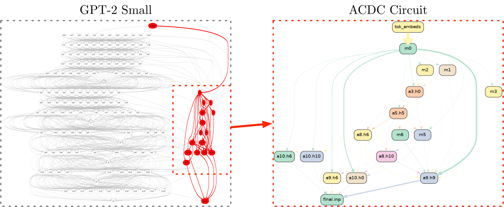

[]() [](https://github.com/ArthurConmy/Automatic-Circuit-Discovery/pulls)

# Automatic Circuit DisCovery 



This is the accompanying code to the paper ["Towards Automated Circuit Discovery for Mechanistic Interpretability"](https://arxiv.org/abs/2304.14997).

* :zap: To run ACDC, see `acdc/main.py`, or <a href="https://colab.research.google.com/github/ArthurConmy/Automatic-Circuit-Discovery/blob/main/notebooks/colabs/ACDC_Main_Demo.ipynb">this Colab notebook</a>
* :wrench: To see how edit edges in computational graphs in models, see `notebooks/editing_edges.py` or <a href="https://colab.research.google.com/github/ArthurConmy/Automatic-Circuit-Discovery/blob/main/notebooks/colabs/ACDC_Editing_Edges_Demo.ipynb">this Colab notebook</a>
* :sparkle: To understand the low-level implementation of completely editable computational graphs, see <a href="https://colab.research.google.com/github/ArthurConmy/Automatic-Circuit-Discovery/blob/main/notebooks/colabs/ACDC_Implementation_Demo.ipynb">this Colab notebook</a> or `notebooks/implementation_demo.py`

This library builds upon the abstractions (`HookPoint`s and standardised `HookedTransformer`s) from [TransformerLens](https://github.com/neelnanda-io/TransformerLens) :mag_right:

## Installation:

First, install the system dependencies for either [Mac](#apple-mac-os-x) or [Linux](#penguin-ubuntu-linux).

Then, you need Python 3.8+ and [Poetry](https://python-poetry.org/docs/) to install ACDC, like so

```bash
git clone git+https://github.com/ArthurConmy/Automatic-Circuit-Discovery.git
cd Automatic-Circuit-Discovery
poetry env use 3.10      # Or be inside a conda or venv environment
                         # Python 3.10 is recommended but use any Python version >= 3.8
poetry install
```

### System Dependencies

#### :penguin: Ubuntu Linux

```bash
sudo apt-get update && sudo apt-get install libgl1-mesa-glx graphviz build-essential graphviz-dev
```

You may also need `apt-get install python3.x-dev` where `x` is your Python version (also see [the issue](https://github.com/ArthurConmy/Automatic-Circuit-Discovery/issues/57) and [pygraphviz installation troubleshooting](https://pygraphviz.github.io/documentation/stable/install.html))

#### :apple: Mac OS X

On Mac, you need to let pip (inside poetry) know about the path to the Graphviz libraries.

```
brew install graphviz
export CFLAGS="-I$(brew --prefix graphviz)/include"
export LDFLAGS="-L$(brew --prefix graphviz)/lib"
```

### Reproducing results

To reproduce the Pareto Frontier of KL divergences against number of edges for ACDC runs, run `python experiments/launch_induction.py`. Similarly, `python experiments/launch_sixteen_heads.py` and `python subnetwork_probing/train.py` were used to generate individual data points for the other methods, using the CLI help. All these three commands can produce wandb runs. We use `notebooks/roc_plot_generator.py` to process data from wandb runs into JSON files (see `experiments/results/plots_data/Makefile` for the commands) and `notebooks/make_plotly_plots.py` to produce plots from these JSON files.

## Tests

From the root directory, run 

```bash
pytest -vvv -m "not slow"
```

This will only select tests not marked as `slow`. These tests take a _long_ time, and are good to run occasionally, but
not every time.

You can run the slow tests with

``` bash
pytest -s -m slow
```

## Contributing 

We welcome issues where the code is unclear!

If your PR affects the main demo, rerun 
```bash
chmod +x experiments/make_notebooks.sh
./experiments/make_notebooks.sh
```
to automatically turn the `main.py` into a working demo and check that no errors arise. It is essential that the notebooks converted here consist only of `#%% [markdown]` markdown-only cells, and `#%%` cells with code.

## Citing ACDC

If you use ACDC, please reach out! You can reference the work as follows:

```
@misc{conmy2023automated,
      title={Towards Automated Circuit Discovery for Mechanistic Interpretability}, 
      author={Arthur Conmy and Augustine N. Mavor-Parker and Aengus Lynch and Stefan Heimersheim and Adri{\`a} Garriga-Alonso},
      year={2023},
      eprint={2304.14997},
      archivePrefix={arXiv},
      primaryClass={cs.LG}
}
```

## TODO

<details>
<summary>Mostly finished TODO list</summary>

[ x ] Make `TransformerLens` install be Neel's code not my PR

[ x ] Add `hook_mlp_in` to `TransformerLens` and delete `hook_resid_mid` (and test to ensure no bad things?)

[ x ] Delete `arthur-try-merge-tl` references from the repo

[ x ] Make notebook on abstractions

[ ? ] Fix huge edge sizes in Induction Main example and change that occurred

[ x ] Find a better way to deal with the versioning on the Colabs installs...

[ ] Neuron-level experiments

[ ] Position-level experiments

[ ] Edge gradient descent experiments

[ ] Implement the circuit breaking paper

[ x ] `tracr` and other dependencies better managed

[ ? ] Make SP tests work (lots outdated so skipped) - and check SubnetworkProbing installs properly (no __init__.pys !!!)

[ ? ] Make the 9 tests also failing on TransformerLens-main pass

[ x ] Remove Codebase under construction

</details>
